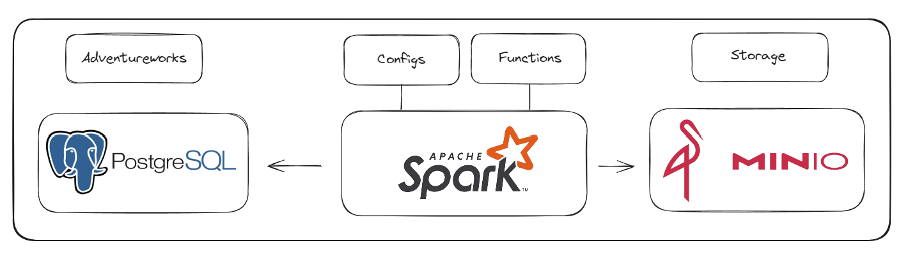

# AdventureWorks

## Architecture


## How to access Jupyter
localhost:8889

## Structure
```
src/
└── notebooks
    ├── 106_el_postgres_to_landing_adventureworks.ipynb
    ├── 107_el_landing_to_bronze_adventureworks.ipynb
    ├── 108_process_bronze_to_silver_adventureworks.ipynb
    ├── 109_refinement_silver_to_gold_adventureworks.ipynb
    ├── configs
    │   ├── __init__.py
    │   └── configs.py
    ├── examples
    │   ├── 100_hello_sparkanos.ipynb
    │   ├── 101_sample_write_delta_table.ipynb
    │   ├── 102_sample_read_delta_table.ipynb
    │   ├── 103_sample_time_travel.ipynb
    │   ├── 104_cdf.ipynb
    │   ├── 105_schema_evolution.ipynb
    │   ├── 106_merge.ipynb
    │   ├── 107_spark_sql.ipynb
    │   └── 108_structured_streaming.ipynb
    ├── functions
    │   ├── __init__.py
    │   └── functions.py
    ├── requirements.txt
```

## Notebooks
The notebooks directory contains Jupyter notebooks that guide the user through various stages of a typical ELT pipeline and demonstrate specific functionalities within Spark and Delta Lake.

## Configs
The configs directory contains configuration files that are used throughout the notebooks and functions.

__init__.py: This file makes the directory a Python package.

configs.py: This module contains configuration settings, such as database connection strings, file paths, and other parameters that are used in the notebooks.

## Functions
The functions directory contains Python modules that provide reusable functions for the notebooks.

__init__.py: This file makes the directory a Python package.

functions.py: This module contains reusable functions, such as data transformation utilities, that can be imported and used across different notebooks.

## Examples
The examples directory contains Jupyter notebooks that demonstrate various Spark and Delta Lake features.