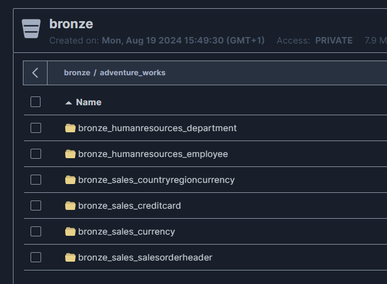

# Convetional names

## Notebooks
    ├── 106_el_postgres_to_landing_adventureworks.ipynb
    ├── 107_el_landing_to_bronze_adventureworks.ipynb
    ├── 108_process_bronze_to_silver_adventureworks.ipynb
    ├── 109_refinement_silver_to_gold_adventureworks.ipynb

## Tables



## Dags
```
dag_adventure_works.py
```