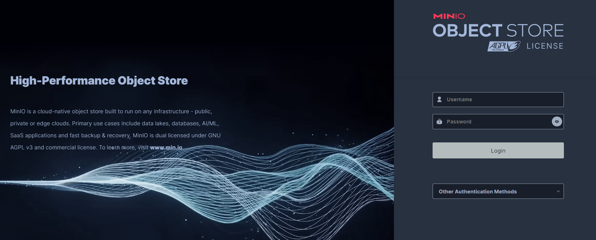

# Minio

## Run Postgres
### Step 1
```
cd minio
```
### Step 2
```
sudo docker compose up -d
```

## Credentials Postgres
```
cd minio
```
file ```.env```

### Access minio
localhost:9000

sample Minio UI:

