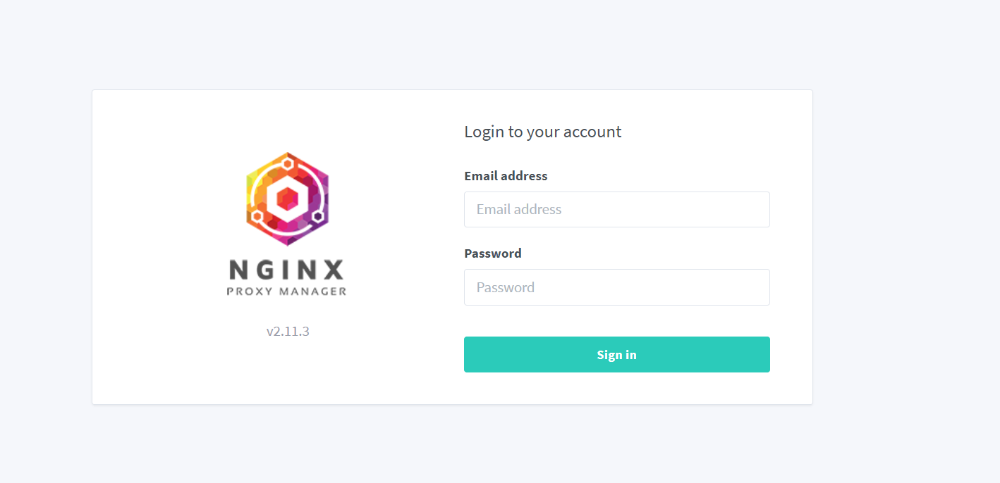

# Nginx Proxy Manager

## Run Nginx Proxy Manager
### Step 1
```
cd applications/nginx_proxy_manager
```
### Step 2
```
sudo docker compose up -d
```

## Credentials Nginx Proxy Manager
```
cd applications/nginx_proxy_manager
```
file ```secret-nginx.txt```

### Access Nginx Proxy Manager
localhost:81

sample Nginx Proxy Manager UI:



