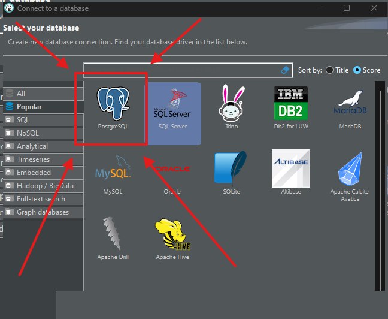
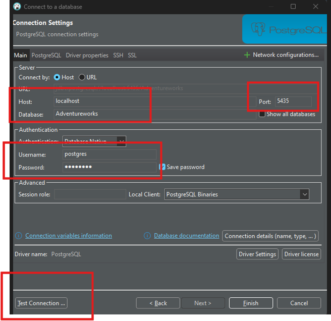

# Postgres

## Run Postgres
### Step 1
```
cd postgres_adventureworks
```
### Step 2
```
sudo docker compose up -d
```

## Credentials Postgres
```
cd postgres_adventureworks
```
file ```.env```

### Access Postgres via Dbeaver
Step 1: 



Step 2:

