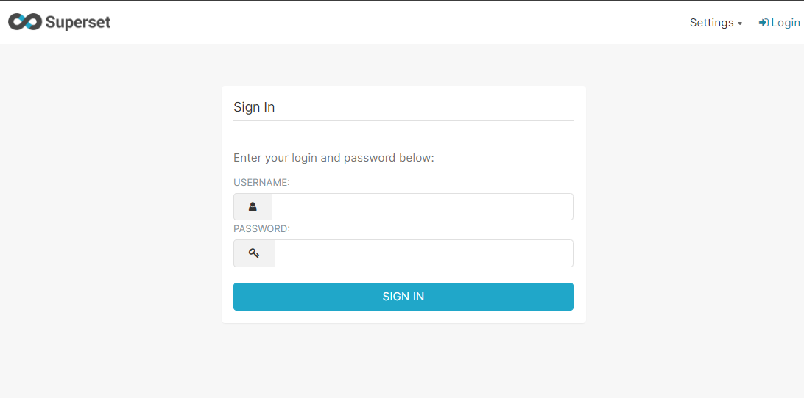

# Superset

## Run Superset
### Step 1
```
cd applications/superset
```
### Step 2
```
sudo docker compose up -d
```

## Credentials Superset
### Step 1
```
cd applications/superset
```

file ```key-superset.txt```

### Access Superset
localhost:8088

sample Superset UI:



