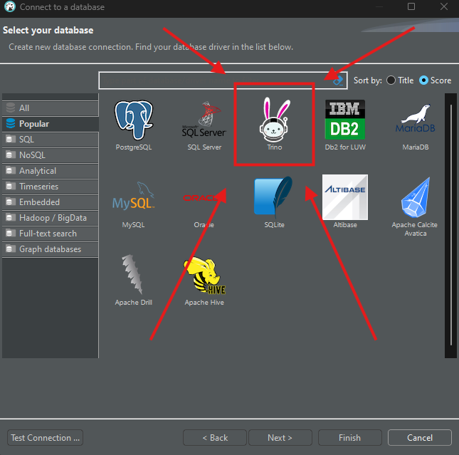
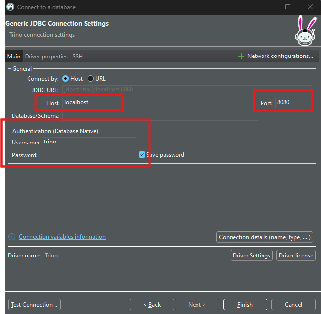
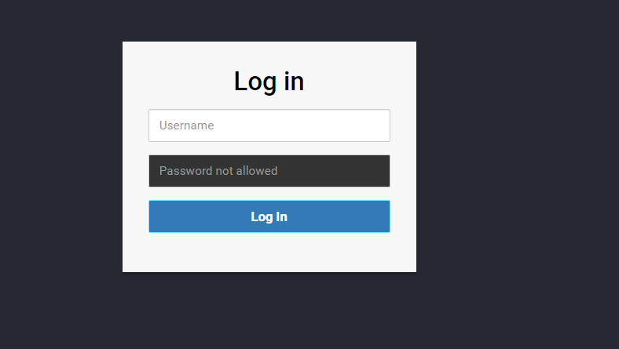

# Trino

## Run Trino
### Step 1
```
cd trino
```
### Step 2
```
sudo docker compose up -d
```

## Credentials Trino
username: trino


### Access Trino via Dbeaver
Step 1: 



Step 2:



### Access Trino via UI
localhost:8080

username: trino 

sample Trino UI:


