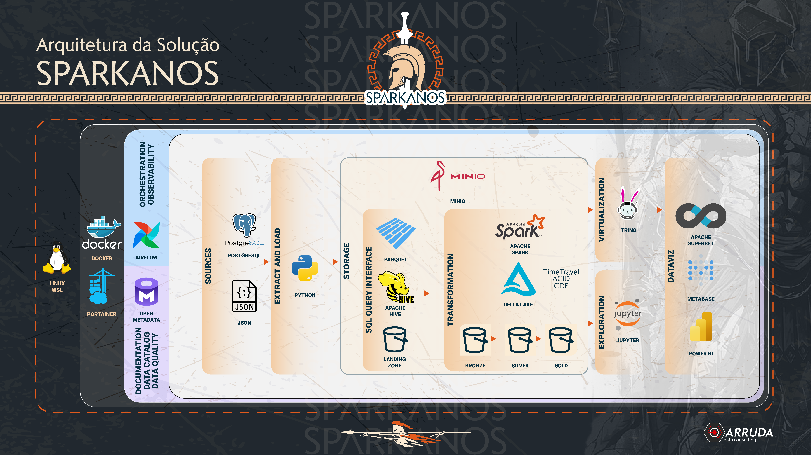

# Tools

## Airflow
Apache Airflow is an open-source workflow management platform designed to programmatically author, schedule, and monitor complex data pipelines. It allows users to define workflows as directed acyclic graphs (DAGs) of tasks using Python, providing a high degree of flexibility and scalability.

## Trino
Trino, formerly known as PrestoSQL, is an open-source distributed SQL query engine designed for running fast, interactive analytic queries against various data sources, from large-scale data lakes to relational databases. It supports querying data where it lives, without requiring data movement.

## Spark
Apache Spark is an open-source unified analytics engine designed for large-scale data processing. It provides an interface for programming entire clusters with implicit data parallelism and fault tolerance. Spark supports various data processing tasks, including batch processing, stream processing, machine learning, and graph processing.

## Superset
Apache Superset is an open-source data exploration and visualization platform designed to be highly interactive and intuitive. It allows users to create and share dashboards and charts, enabling data-driven decision-making. Superset supports a wide range of data sources and integrates seamlessly with modern databases.

## Minio
Minio is an open-source object storage server compatible with the Amazon S3 cloud storage service. It is designed for high-performance, scalable storage infrastructure and is suitable for storing unstructured data such as photos, videos, log files, backups, and container images. Minio is optimized for private cloud environments.

## Open Metadata
Open Metadata is an open-source data catalog and metadata management platform. It is designed to provide comprehensive data discovery, governance, and collaboration capabilities for organizations. Open Metadata allows users to centralize and manage metadata from various data sources, facilitating data lineage, quality, and compliance. It supports a wide range of integrations, enabling seamless connection with data warehouses, lakes, BI tools, and other systems, thereby enhancing data transparency and enabling better decision-making.
