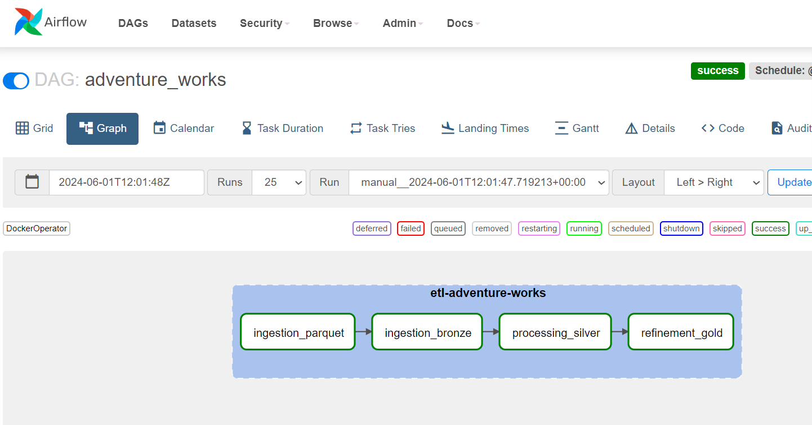
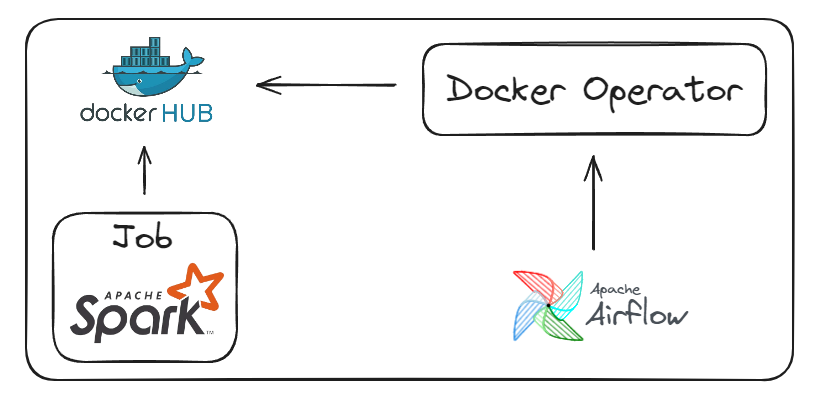

# Airflow


# How to create a DAG in Airflow?

## Sample DAG Adventure Works on Airflow UI



------------------------------------------------------------------

# How does the Docker Operator work?


The Spark job should be created and published on Docker HUB. Airflow will create a temporary container that will download the image, execute the job, and then destroy the container.

------------------------------------------------------------------

## Example Spark code 

```111_sample_airflow.py```

```
from pyspark import SparkConf, SparkContext
from pyspark.sql import SparkSession
from pyspark.sql.functions import *
from pyspark.sql.types import *

# Configuração do Spark
conf = SparkConf()
conf.setAppName("Write Delta Bronze Employee")
conf.set("spark.hadoop.fs.s3a.endpoint", "http://172.21.121.140:9000")
conf.set("spark.hadoop.fs.s3a.access.key", "chapolin")
conf.set("spark.hadoop.fs.s3a.secret.key", "mudar@123")
conf.set("spark.hadoop.fs.s3a.path.style.access", True)
conf.set("spark.hadoop.fs.s3a.impl", "org.apache.hadoop.fs.s3a.S3AFileSystem")
conf.set(
    "spark.hadoop.fs.s3a.aws.credentials.provider",
    "org.apache.hadoop.fs.s3a.SimpleAWSCredentialsProvider",
)
conf.set("spark.sql.extensions", "io.delta.sql.DeltaSparkSessionExtension")
conf.set(
    "spark.sql.catalog.spark_catalog", "org.apache.spark.sql.delta.catalog.DeltaCatalog"
)
conf.set("hive.metastore.uris", "thrift://metastore:9083")

# Inicialização da sessão do Spark
spark = SparkSession.builder.config(conf=conf).enableHiveSupport().getOrCreate()

# Dados de exemplo
data2 = [
    ("James", "", "Smith", "36636", "M", 3000),
    ("Michael", "Rose", "", "40288", "M", 4000),
    ("Robert", "", "Williams", "42114", "M", 4000),
    ("Maria", "Anne", "Jones", "39192", "F", 4000),
    ("Jen", "Mary", "Brown", "", "F", -1),
]

# Esquema dos dados
schema = StructType(
    [
        StructField("firstname", StringType(), True),
        StructField("middlename", StringType(), True),
        StructField("lastname", StringType(), True),
        StructField("id", StringType(), True),
        StructField("gender", StringType(), True),
        StructField("salary", IntegerType(), True),
    ]
)

# Criando DataFrame
df = spark.createDataFrame(data=data2, schema=schema)


df.write.format("delta").mode("append").save("s3a://bronze/airflow_table")
```

-----------------------------------------------------------------------------

## Example DAG with Docker Operator

```
from datetime import datetime
from airflow import DAG
from airflow.providers.docker.operators.docker import DockerOperator

default_args = {
    'owner': 'Wallace Camargo',
    'depends_on_past': False,
}

# Definição da função run_container
def run_container(dag, image, container_name, command):
    return DockerOperator(
        task_id=container_name,
        image=image,
        container_name=container_name,
        api_version='auto',
        auto_remove=True,
        command=command,
        docker_url="tcp://docker-proxy:2375",
        network_mode="sparkanos",
        mount_tmp_dir=False,  # Disable mounting the temporary directory
        dag=dag  # Passando a referência da DAG para o operador
    )

# Definição da DAG
with DAG(
    'sample_airflow',
    default_args=default_args,
    start_date=datetime(2023, 1, 1),  # Use a fixed start date
    schedule_interval='@weekly',
    catchup=False,  # Adiciona este parâmetro para evitar a execução de tarefas passadas
    tags=['postgres', 'delta lake', 'comercial']
) as dag:

    sample_employee_task = run_container(
        dag=dag,
        image='sparkanos',
        container_name='sample_airflow',
        command="spark-submit /app/111_sample_airflow.py"
    )

    sample_employee_task
```