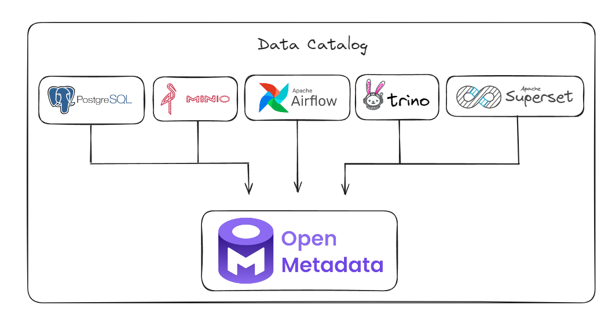
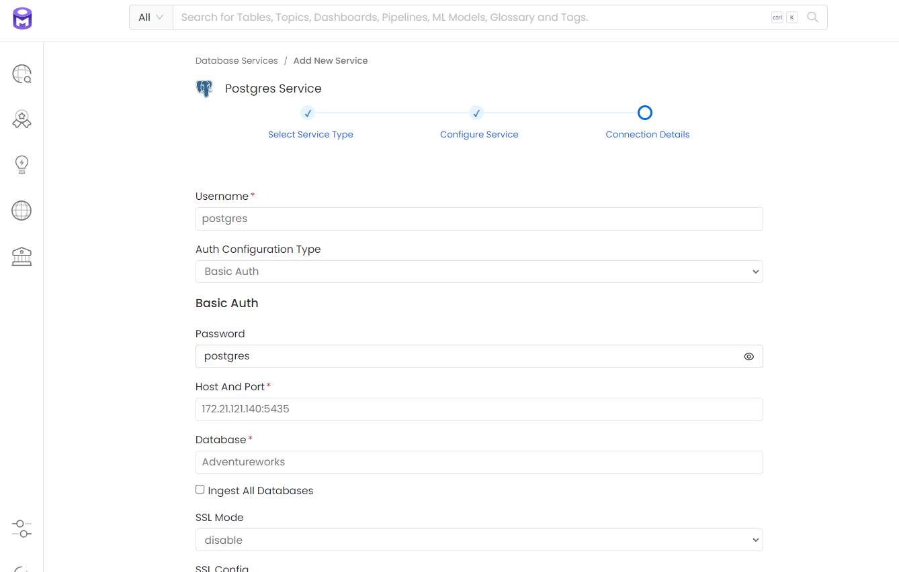
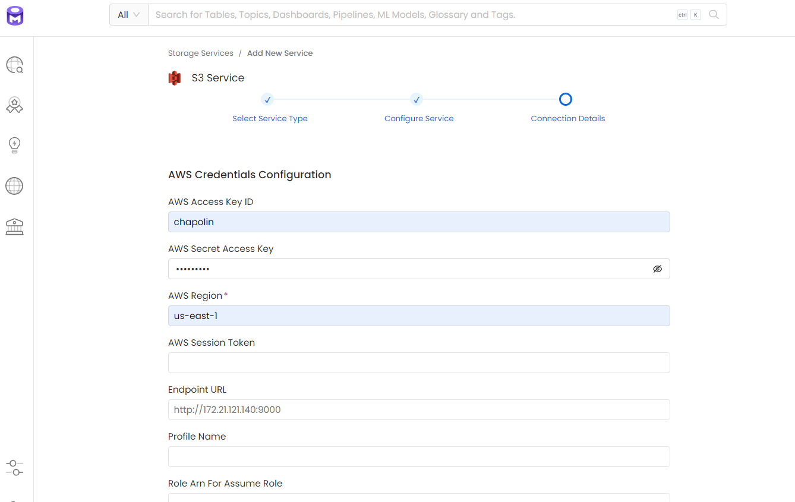
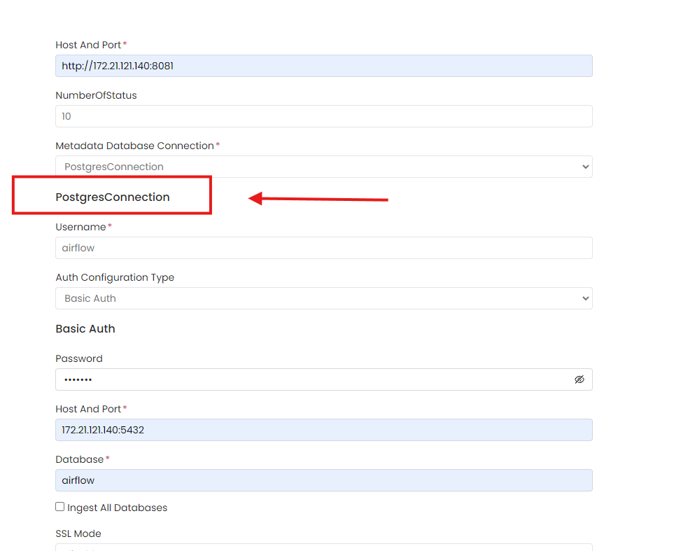
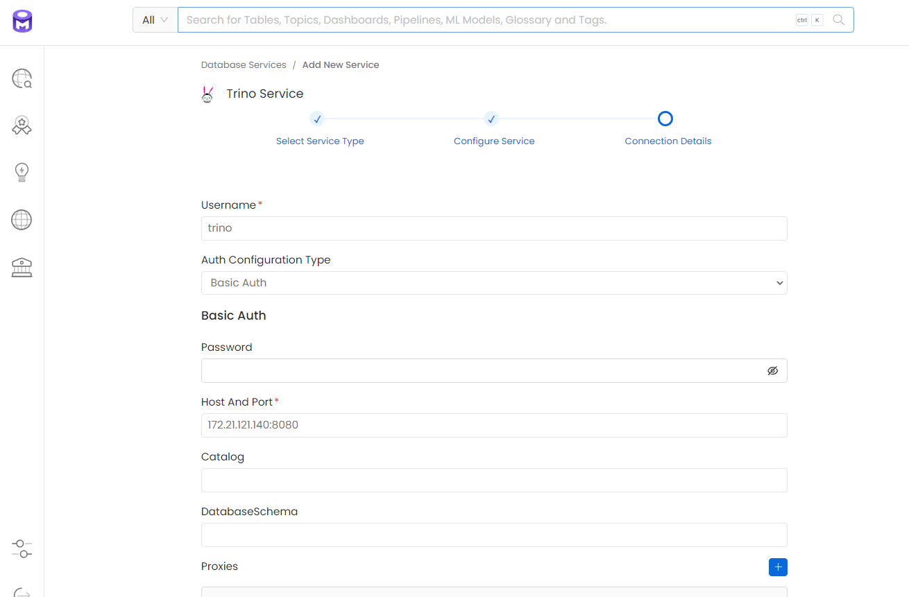
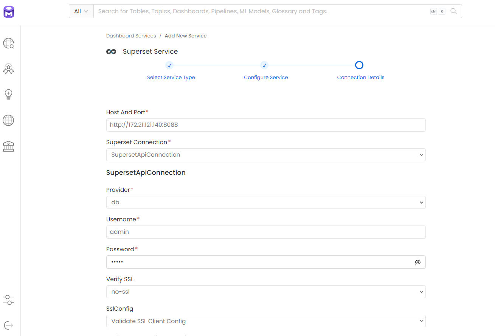

# Open Metadata

## All Cataloged Services



## Cataloging PostgreSQL

```
Username: postgres
Password: postgres
Host: 172.21.121.140:5435
Database: Adventureworks
```

## Cataloging Minio

```
AWS Access Key ID: chapolin
AWS Secret Access Key: mudar@123
AWS Region: us-east-1
Endpoint URL: http://minio:9000
```

## Cataloging Airflow

```
Host: http://172.21.121.140:8081
Username: airflow
Password: airflow
Database: airflow
Host Postgres: 172.21.121.140:5432
```

## Cataloging Lakehouse/Trino

```
Username: trino
Host: 172.21.121.140:8080
```

## Cataloging Superset

```
Host: http://172.21.121.140:8088
Username: admin
Password: admin
```