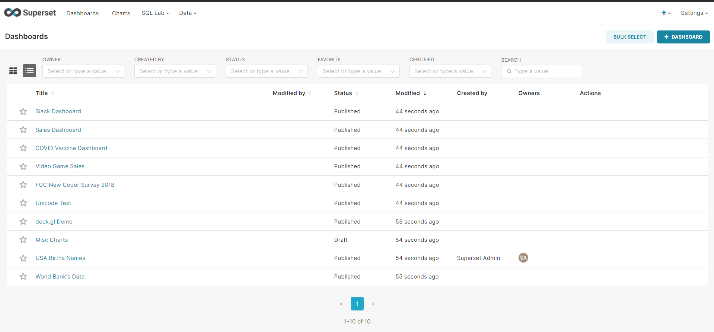

# How to use Superset

## RLS Rules

### Admin (Administrador)
Os administradores têm todos os direitos possíveis, incluindo conceder ou revogar direitos de outros usuários e alterar os "slices" e dashboards de outras pessoas.

### Alfa
Usuários Alfa têm acesso a todas as fontes de dados, mas não podem conceder ou revogar acesso de outros usuários. Eles também estão limitados a alterar apenas os objetos que possuem. Usuários Alfa podem adicionar e alterar fontes de dados.

### Gamma
Usuários Gama têm acesso limitado. Eles só podem consumir dados provenientes de fontes de dados às quais foram concedidos acesso através de outro papel complementar. Eles têm acesso apenas para visualizar os "slices" e dashboards feitos a partir das fontes de dados às quais têm acesso. Atualmente, os usuários Gama não podem alterar ou adicionar fontes de dados. Assumimos que eles são principalmente consumidores de conteúdo, embora possam criar "slices" e dashboards.

Também vale notar que, quando usuários Gama visualizam a lista de dashboards e "slices", eles só verão os objetos aos quais têm acesso.

### sql_lab
O papel sql_lab concede acesso ao SQL Lab. Note que, enquanto usuários Admin têm acesso a todos os bancos de dados por padrão, tanto os usuários Alfa quanto Gama precisam ser concedidos acesso a cada banco de dados individualmente.

### Public (Público)
Para permitir que usuários deslogados acessem alguns recursos do Superset, você pode usar a configuração PUBLIC_ROLE_LIKE e atribuí-la a outro papel cujas permissões você deseja passar para este papel.

Por exemplo, ao definir PUBLIC_ROLE_LIKE = "Gamma" no seu arquivo superset_config.py, você concede ao papel público o mesmo conjunto de permissões que o papel Gama. Isso é útil se você quiser permitir que usuários anônimos visualizem dashboards. A concessão explícita de conjuntos de dados específicos ainda é necessária, o que significa que você precisa editar o papel Public e adicionar as fontes de dados públicas ao papel manualmente.

