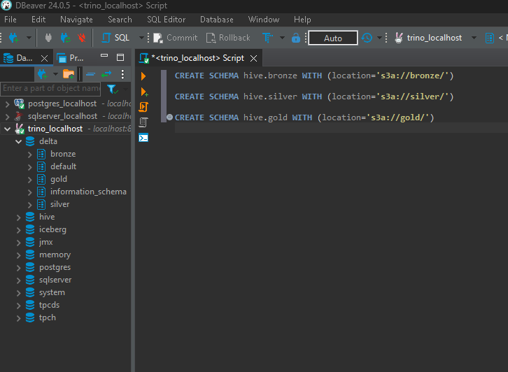

# Trino

## How to Connect to Trino via DBeaver?
```
Host: localhost

Username: trino

Port: 8080
```


## How to Virtualize Tables from Minio?
- Create buckets in Minio.
- Then create schemas in Trino with the following commands:

```
CREATE SCHEMA hive.bronze WITH (location='s3a://bronze/')

CREATE SCHEMA hive.silver WITH (location='s3a://silver/')

CREATE SCHEMA hive.gold WITH (location='s3a://gold/')
```




## Create Connection with Superset
```
trino://trino@host.docker.internal:8080/delta
```