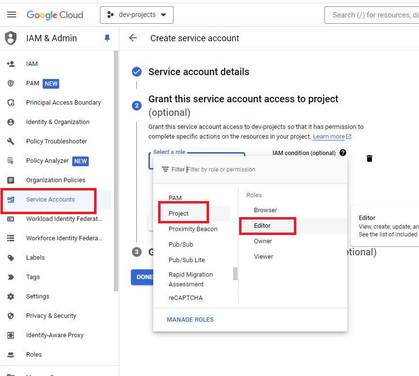

# Server on GCP
The Terraform script will create a server on Google Cloud Platform with Docker pre-installed.

## Architecture


## Pre-requisites
* Account GCP
* Terraform
* Service Account
* Gcloud

## How to unlock pre-requisites?
### Create a GCP Account
https://cloud.google.com/gcp?utm_source=google&utm_medium=cpc&utm_campaign=emea-pt-all-en-bkws-all-all-trial-e-gcp-1707574&utm_content=text-ad-none-any-DEV_c-CRE_500236818915-ADGP_Hybrid+%7C+BKWS+-+EXA+%7C+Txt+-+GCP+-+General+-+v2-KWID_43700060393215932-kwd-26415313501-userloc_1011706&utm_term=KW_google+cloud+platform-NET_g-PLAC_&&gad_source=1&gclid=Cj0KCQjwkdO0BhDxARIsANkNcre2YPHl0aAjD2axVkIY73LuseDL5EV52Opg56LyDOAjpXHZbqRNemwaAl3iEALw_wcB&gclsrc=aw.ds&hl=en

### Install Terraform
https://developer.hashicorp.com/terraform/tutorials/aws-get-started/install-cli

### Install Gcloud
https://cloud.google.com/sdk/docs/install

## How export service account?
Step 1: Create service account


Step 2: Export service account


## How to use Terraform?
```
terraform init
```

```
terraform plan
```

```
terraform apply
```

## Get your public IP
```
curl ifconfig.me
```

## How to use Gcloud?
## Initialize Gcloud
```
gcloud init
```

## Create firewall rules
### For private IP
```
gcloud compute firewall-rules create bigdata-rule-restrict-ip --network=default --allow=tcp:80,tcp:443,tcp:5432,tcp:5435,tcp:27017,tcp:3306,tcp:4040,tcp:4040,tcp:4043,tcp:7077,tcp:8005,tcp:8080,tcp:8081,tcp:8087,tcp:8180,tcp:8585,tcp:8888,tcp:8889,tcp:9000,tcp:9001,tcp:9003 --source-ranges=YOUR_IP/32 --description="Allow access to specific ports only from my public IP"
```

### For all
```
gcloud compute firewall-rules create bigdata-rule-public-ip --network=default --allow=tcp:8088 --source-ranges=0.0.0.0/0 --description="Allow access to port 8088 from the world"
```

